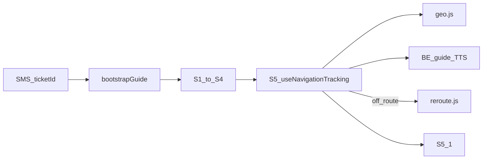

# Frontend 인수인계 (HANDOVER)

다음 담당자가 **클론 → 실행 → S5 데모**까지 당일에 이어갈 수 있도록 정리한 문서입니다.  
내비 판정 수치·실내 방위 상세는 [`../README.md`](../README.md)를 보세요.

**라이브 데모:** [https://freepass-korail.vercel.app/](https://freepass-korail.vercel.app/)

> 시크릿(비밀번호·토큰·개인키)은 이 문서에 넣지 않습니다.  
> 계정·키는 팀 비밀번호 관리 도구로만 전달하세요.

---

## 1. 기본 환경 및 실행

### 1.1 기술 스택

| 구분 | 기술 | 버전 (package.json 기준) |
|------|------|--------------------------|
| 프레임워크 | React | 19.2.x |
| 빌드 | Vite | 8.1.x |
| 상태 | Zustand | 5.0.x |
| 스타일 | styled-components | 6.4.x |
| 유틸 스타일 | Tailwind CSS (+ Vite 플러그인) | 4.3.x |
| 단위 테스트 | Vitest | 4.1.x |
| E2E | Playwright | 1.62.x |
| 린트 | ESLint | 10.x |

브라우저 API: **Geolocation**, **DeviceOrientation**, **Vibration** (도착 햅틱).  
UI 컴포넌트 라이브러리(MUI 등)는 **사용하지 않음**.

### 1.2 설치 및 실행

| 항목 | 값 |
|------|-----|
| 작업 디렉터리 | `first-project/` |
| 패키지 매니저 | **npm** (`package-lock.json` 사용. yarn/pnpm 미사용) |
| Node.js | `engines` 미지정 → **Node 20 LTS 권장** |

```bash
cd first-project
npm install
cp .env.example .env   # 필요 시 값 채움
npm run dev
```

| 명령 | 용도 |
|------|------|
| `npm run dev` | 로컬 개발 (`http://localhost:5173`) |
| `npm run build` | 프로덕션 빌드 → `dist/` |
| `npm run preview` | 빌드 결과 미리보기 |
| `npm run lint` | ESLint |
| `npm test` | Vitest 단위 테스트 |
| `npm run test:e2e` | Playwright E2E (실 BE + GPS 시나리오) |
| `npm run test:e2e:demo` | 사람 보행 속도 + TTS 청취용 E2E |

진입 예:

```
http://localhost:5173/?ticketId=19
https://freepass-korail.vercel.app/?ticketId=19
```

- 위치·나침반은 **HTTPS 또는 localhost**에서만 동작
- 카카오톡 인앱 브라우저는 위치 권한 이슈 가능 → **Safari 권장**

### 1.3 환경 변수

템플릿: [`.env.example`](../.env.example)

| 변수 | 필수 | 설명 |
|------|------|------|
| `VITE_API_BASE_URL` | 선택 | API 절대 URL. **비우면** 상대 경로 `/api` (Vite·Vercel 프록시 사용) |
| `VITE_API_PROXY_TARGET` | 로컬 권장 | Vite `server.proxy` 대상. 미설정 시 `http://localhost:8080` |
| `VITE_APP_ORIGIN` | 배포 시 | SMS 딥링크용 프론트 origin. 기본 `https://freepass-korail.vercel.app` |

실개발 BE 예 (로컬 `.env`):

```bash
VITE_API_PROXY_TARGET=http://43.201.30.167:8080
# VITE_APP_ORIGIN=https://freepass-korail.vercel.app
```

**주의:** BE 주소가 바뀌면 `.env`뿐 아니라 [`vercel.json`](../vercel.json)의 `/api` rewrite destination도 함께 수정해야 합니다.  
배포 URL을 바꾸면 `VITE_APP_ORIGIN`과 **BE SMS 템플릿**의 링크도 동기화합니다.

---

## 2. 프로젝트 구조 및 핵심 로직

### 2.1 폴더 구조

```
first-project/
├─ src/
│  ├─ api/              # fetch 래퍼, normalize, bootstrap, reroute, tickets
│  ├─ components/       # 화면 S1~S5, E1~E6 + common/
│  ├─ constants/        # STATION_START 등
│  ├─ hooks/            # GPS, 나침반, 내비 추적, 화살표 추종
│  ├─ store/            # Zustand (useFlowStore)
│  ├─ styles/           # theme, figmaLayout, GlobalStyles
│  ├─ utils/            # geo.js(핵심), session, audio, guideStates …
│  ├─ App.jsx           # step 기반 화면 전환
│  └─ main.jsx
├─ e2e/                 # Playwright GPS 시나리오
├─ scripts/             # e2e-browser, sim-ticket56 등
├─ docs/                # 인수인계·테스트 메모 (본 문서)
├─ vercel.json          # /api → BE 프록시
├─ .env.example
└─ package.json
```

| 경로 | 역할 |
|------|------|
| `src/components/` | 플로우 화면. 파일명 ≈ 화면 ID (`S5_Navigation.jsx`) |
| `src/components/common/` | 공통 UI (Layout, Button, 권한 모달, 화살표 등) |
| `src/hooks/useNavigationTracking.js` | S5 실시간 GPS·진행·이탈·재탐색·화살표 |
| `src/utils/geo.js` | 거리·투영·도착/이탈/출발잠금·`headingBearing` 방위 |
| `src/api/bootstrapGuide.js` | `?ticketId=` 진입·출발 TTS fallback |
| `src/api/reroute.js` | 경로 이탈 후 재탐색 |
| `src/api/normalize.js` | BE 응답 → FE step ( **`headingBearing` 보존 필수** ) |
| `src/store/useFlowStore.js` | `step`, 경로, 거리, bearing, TTS 맵 등 |

### 2.2 공통 컴포넌트

- 외부 UI 라이브러리 **없음**
- 위치: `src/components/common/`
  - `Layout.jsx`, `ScreenShell.jsx`, `Button.jsx` / `FigmaPrimaryButton.jsx`
  - `FigmaHeader.jsx`, `FigmaTitle.jsx` — Figma 절대 좌표 레이아웃
  - `MapContainer.jsx` — **실제 지도 SDK 없음** (placeholder + pan/marker mock)
  - `S5NavigationArrow.jsx`, `PermissionModal.jsx`, `GeolocationDeniedModal.jsx`
  - `NetworkOfflineOverlay.jsx`, `SpeakerIcon.jsx`

### 2.3 라우팅 및 상태

- **React Router 없음.** [`App.jsx`](../src/App.jsx)가 Zustand `step`으로 switch 렌더
- `setStep('S1' | 'S2' | … | 'S5_1' | 'E3' | …)` 로 화면 이동
- 전역 상태: **Zustand 단일 스토어** [`useFlowStore.js`](../src/store/useFlowStore.js)
- **sessionStorage 재개 비활성** ([`session.js`](../src/utils/session.js)): 예전 경로가 GPS와 맞물려 곧장 도착으로 튀는 버그 방지. 새로고침 시 항상 S1부터

화면 흐름:

```
?ticketId= → bootstrapGuide → S1 → S2(권한) → S3(층) → S4 → S5 → S5_1(도착)
예외: E1~E6, S5_2(대체 경로)
```

### 2.4 핵심 로직 포인터



| 관심사 | 파일 |
|--------|------|
| URL 부트스트랩·출발 TTS 보완 | `src/api/bootstrapGuide.js` |
| S5 루프 | `src/hooks/useNavigationTracking.js` |
| 거리·이탈·도착·복도 방위 | `src/utils/geo.js` (`getGuidanceBearing`, `headingBearing`) |
| 나침반 accuracy 게이트 | `src/hooks/useDeviceOrientation.js` |
| 이탈 재탐색 | `src/api/reroute.js` |

판정 상수·실내 GPS 주의사항: [`../README.md`](../README.md)

---

## 3. API 및 외부 연동

### 3.1 API 호출 방식

- **Axios 없음.** [`src/api/client.js`](../src/api/client.js)의 `fetch` 래퍼 `apiRequest`
- 베이스: `src/api/config.js` → `API_BASE = import.meta.env.VITE_API_BASE_URL ?? ''`
- 로컬/배포 모두 보통 **상대 `/api`** + 프록시로 BE에 전달

| 환경 | 프록시 |
|------|--------|
| 로컬 Vite | `vite.config.js` → `VITE_API_PROXY_TARGET` (`/api`, `/sms`) |
| Vercel | `vercel.json` rewrite → `http://43.201.30.167:8080/api/...` |

BE (현재): `http://43.201.30.167:8080`

### 3.2 주요 엔드포인트

| 메서드 | 경로 | 설명 |
|--------|------|------|
| GET | `/api/tickets/{ticketId}/guide` | 문자 링크 권장 — 경로 |
| GET | `/api/tickets/{ticketId}/guide/steps` | 문구·TTS + `states` |
| POST | `/sms/test/{ticketId}` | 안내 문자 테스트 발송 |
| GET | `/api/paths?from=&to=` | 노드 간 경로 (재탐색 폴백) |
| POST | `/api/v1/guide/routes` | lat/lng 경로 (재탐색 3순위) |
| POST | `/api/v1/guide/complete` | 길찾기 완료 알림 |
| GET | `/api/users/{userId}/guide` | 레거시 |
| GET | `/api/v1/guide/sessions/{token}` | 레거시 세션 |

`states`: `OFF_ROUTE`, `DESTINATION_PASSED`, `DEPARTURE_TIME_PASSED`, `ARRIVED`  
경로 구간 필드: `distanceToNextM`, `cumulativeDistanceM`, **`headingBearing`**(실내 화살표 1순위)

모듈 위치: `src/api/tickets.js`, `guide.js`, `sms.js`, `reroute.js`, `normalize.js`

### 3.3 인증 (Auth)

- **JWT / 쿠키 로그인 없음**
- 진입 키: URL 쿼리
  - 권장: `?ticketId=`
  - 레거시: `?userId=`, `?token=` (세션 API)
- 로그인 유지·리프레시 토큰 로직 **없음**. SMS로 받은 링크로 매번 새로 시작

### 3.4 서드파티

| 종류 | 상태 |
|------|------|
| GA / 광고 트래킹 | 미연동 |
| Sentry 등 에러 로깅 | 미연동 |
| 결제 | 미연동 |
| 지도 SDK (카카오/네이버 등) | 미연동 — `MapContainer` mock |
| 브라우저 센서 | Geolocation + DeviceOrientation + Vibration |

### 3.5 브라우저·OS별 나침반

나침반 로직은 OS마다 **다른 API 경로**를 탄다. Android에서 “25° accuracy 게이트가 안 먹는다”고 FE 버그로 보지 말 것.

코드: [`src/hooks/useDeviceOrientation.js`](../src/hooks/useDeviceOrientation.js) (`getDeviceHeading`), 상수 `COMPASS_MAX_ACCURACY_DEG = 25` (`geo.js`).

| 플랫폼 | 쓰는 필드 | accuracy 게이트 | 비고 |
|--------|-----------|-----------------|------|
| **iOS Safari** | `webkitCompassHeading` + `webkitCompassAccuracy` | `acc < 0` 또는 `acc > 25°` → heading **버림**(마지막 정상값 유지) | 역사 자기장 왜곡 대응의 핵심. **이 경로에서만** 게이트 동작 |
| **Android Chrome** | `deviceorientationabsolute` / `absolute === true`의 `alpha` | **`webkitCompassAccuracy` 자체가 없음** → 25° 무시 로직 **미적용** | absolute가 아니면 `null`(미확보). 틀린 상대방위 대신 화살표 미표시 |
| 카톡 등 인앱 | 권한·센서 제한 흔함 | 플랫폼에 따름 | Safari/Chrome 직접 실행 권장 |

후임 체크:

- Android에서 accuracy 게이트가 “안 도는” 것은 **의도된 플랫폼 분기**
- 화살표가 안 돌면: `headingReady`, absolute 이벤트 수신 여부, 모션/방향 권한부터 확인
- 실측은 **iOS Safari와 Android Chrome 둘 다** (한쪽에만 맞춰 고치면 다른 쪽이 깨짐)

### 3.6 장애 시 프론트 동작 (BE 다운·네트워크)

`apiRequest`([`client.js`](../src/api/client.js))는 **재시도·백오프 없음**. `!ok` → `ApiError` throw, 네트워크 실패는 `fetch` reject 그대로.

| 상황 | 현재 UI/동작 | 자동 재시도? | 파일 |
|------|--------------|--------------|------|
| `navigator.onLine === false` | 전체 오버레이 “연결이 잠시 끊겼어요. 다시 연결 중이에요.” + 스피너 | **없음** — online 되면 오버레이만 사라짐 (API 재호출 안 함) | `NetworkOfflineOverlay.jsx` |
| BE 다운·타임아웃·5xx (진입 bootstrap) | 상단 빨간 `sessionError` 배너. 부트스트랩 실패 상태 | **없음** | `App.jsx`, `client.js`, `bootstrapGuide.js` |
| 오늘 티켓 없음 | 화면 `E3` | — | `bootstrapGuide` → `NO_TICKET_TODAY` |
| S4 경로 로드 실패 | `setStep('E1')` | 없음 | `S4_Standby.jsx` |
| S5 이탈 재탐색 실패 | 빨간 이탈(`altRoute`) 유지, 콘솔 `[NAV] reroute failed` | 쿨다운 후 이탈이 다시 잡힐 때만 재시도 | `useNavigationTracking.js` `requestReroute` |

중요한 구분:

- **기기 오프라인** 오버레이 ≠ **BE health check**. BE만 죽은 경우에도 `navigator.onLine`은 true일 수 있어, 오프라인 UI가 안 뜨고 진입 에러 배너만 나올 수 있다.
- 진입 실패를 무한 로딩으로 감추지는 않음(배너). 다만 **수동/자동 재시도 UX·Sentry는 없음** → 실서비스에서 가장 먼저 터지는 빈칸 (§5.3).

---

## 4. 배포 및 운영

### 4.1 빌드 및 배포

```bash
cd first-project
npm run build
npm run preview   # 로컬 검증
```

| 항목 | 내용 |
|------|------|
| 호스팅 | **Vercel** |
| 데모 URL | https://freepass-korail.vercel.app/ |
| CI/CD | GitHub Actions **없음**. Vercel ↔ Git 연동 배포 |
| 프록시 | [`vercel.json`](../vercel.json) — `/api/:path*` → BE |

배포 Root Directory는 보통 `first-project`입니다.  
BE IP/도메인 변경 시: `vercel.json` + 로컬 `.env` + (필요 시) Vercel Environment Variables.

SMS에 넣을 링크:

```
https://freepass-korail.vercel.app/?ticketId={ticketId}
```

(`src/api/ticketUrl.js`의 `APP_ORIGIN` / `VITE_APP_ORIGIN`)

### 4.2 도메인·계정·권한 (값 없이 위치만)

인수인계 시 **비밀번호 관리 도구**로 넘길 체크리스트:

| 항목 | 전달 내용 |
|------|-----------|
| Git | 저장소 URL, remote(`origin` / `personal` 등), 쓰기 권한 |
| Vercel | 프로젝트 소유자/멤버, Production 도메인, Env Vars |
| 백엔드 | 담당자 연락처, 서버 URL, 테스트용 API 가능 여부 |
| 테스트 티켓 | 유효 `ticketId` 목록 (예: 19, 51, 56, 61 — **유효성은 BE에 확인**) |
| SMS | 발송 테스트 방법(`POST /sms/test/{id}`), 템플릿의 딥링크 origin |
| 기타 키 | 지도/푸시 등 추가 연동 시 발급 키 (현재 FE는 해당 없음) |

문서·채팅에 시크릿을 붙여 넣지 마세요.

---

## 5. 부록

### 5.1 테스트

```bash
npm test
npm run test:e2e
$env:E2E_TICKET_ID='51'; npm run test:e2e:demo -- -g "1_해피케이스"
```

- E2E: GPS만 시나리오 주입, `guide`/TTS는 **실제 BE** → BE 기동·티켓 필요
- 상세: [`../e2e/README.md`](../e2e/README.md)
- 실측: **iOS Safari + Android Chrome** 둘 다 (나침반 경로가 다름 — §3.5). 역사/승강장 S5. 콘솔 `[NAV]`, `[TTS]`
- BE 장애 수동 확인: BE 중지 후 `/?ticketId=` → 상단 빨간 배너(§3.6). 비행기 모드 → 오프라인 오버레이(재호출은 안 함)

### 5.2 알려진 한계

상태 의미: **완전 해결** / **부분 해결** / **미해결**.  
“BE가 거리를 고쳤다”는 말만으로 해결로 치지 말 것 — **좌표·문구·재실측**으로 확인할 때까지는 열린 이슈다.

| 이슈 | 상태 | 재현 조건 | 관련 파일 |
|------|------|-----------|-----------|
| 실내 GPS 위치·화살표 흔들림 | **부분 해결** | 제천역 승강장·실내. accuracy 나쁨 때 화살표가 옆으로 튐 → 저정확도면 `headingBearing` 복도 방위 우선으로 완화. GPS 오차(자주 10~30m+) 자체는 웹으로 제거 불가 | `geo.js` (`getGuidanceBearing`, `LOW_ACCURACY_M`), `useNavigationTracking.js`, `S5_Navigation.jsx` |
| n02→n03 등 BE 거리↔좌표 불일치 | **미해결(데이터)** | guide의 `distanceToNextM`과 lat/lng Haversine이 어긋남(과거 예: BE ~19m vs 좌표 ~수십 m). UI remain은 BE 거리, 투영·폴백 방위는 좌표 → “걸어도 m가 이상/구간 불분명”. **BE가 거리만 수정했다고 해도 좌표·재실측 전까지 해결로 보지 말 것. FE 완결 수정 아님** | `normalize.js` (`fillStepDistances`), `geo.js` remain·투영 |
| 문구 속 m vs 상단 라이브 m | **미해결(계약)** | S5에서 `screenText`의 `19m` 등과 큰 숫자 remain이 동시에 다름. 전자는 BE 고정 문구 | `useFlowStore`, `guide/steps` / `screenTextMap` |
| 초반 n01·n02 스킵·안내 점프 | **부분 해결** | 첫 GPS가 멀리(에스컬레이터 등)로 튈 때. 출발 잠금·`EARLY_*` 점프/스냅으로 FE 완화 | `geo.js` (`gateProgressFromStart`, `EARLY_*`, `START_ENGAGE_*`) |
| sessionStorage 재개 시 조기 도착 | **완전 해결(의도적 비활성)** | (옛) 새로고침 후 잔여 `routeSteps`+GPS로 곧장 도착. 지금은 저장·복원 끔 → 항상 S1 | `utils/session.js` |
| 지도 영역 | **미해결(미구현)** | S5 등에서 지도 SDK 없음, placeholder | `MapContainer.jsx` |
| 모니터링 / GA | **미해결** | 프로덕션 에러·사용량 추적 없음 | — |
| BE 다운 시 UX | **미해결** | BE 중지 후 진입 → 배너만, 재시도 없음. 오프라인 UI는 BE 장애와 무관할 수 있음 (§3.6) | `App.jsx`, `client.js`, `NetworkOfflineOverlay.jsx` |

### 5.3 실서비스로 이어갈 때 우선 과제 (예시)

1. **BE 장애 화면 + 수동/자동 재시도** (진입·재탐색). 오프라인 오버레이와 BE health 구분  
2. BE HTTPS·안정 도메인 + `vercel.json`/프록시 정리  
3. BE 거리↔좌표·문구 `m` 정합 (n02→n03 등 **데이터 재검증**)  
4. 에러 모니터링(Sentry 등)·실측 로그 정책  
5. “이어하기” 세션이 필요하면 조기 도착 버그 없이 재설계  
6. 인앱 브라우저 UX (“Safari에서 열기”) 고정  
7. 실제 지도 SDK 연동 여부 결정 (`MapContainer` 교체)  
8. UWB/네이티브는 **별 트랙** — 현 웹 스택으로는 불가에 가까움

### 5.4 관련 문서

| 문서 | 내용 |
|------|------|
| [`../README.md`](../README.md) | 기술 스펙, 내비 파이프라인, 판정 상수 |
| [`../e2e/README.md`](../e2e/README.md) | Playwright GPS 시나리오 |
| [`gps-mock-test-user1.md`](./gps-mock-test-user1.md) | GPS mock 테스트 메모 |
| 루트 [`../../README.md`](../../README.md) | 모노레포 빠른 시작 |
